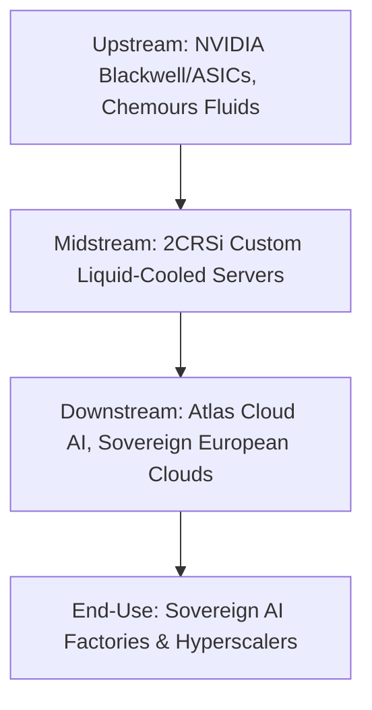

# CHOKEPOINT RESEARCH REPORT — ANALYTICAL SCORER (TURN 2)

### Deep AI supply chain bottleneck analysis — Stock: AL2SI

---

## SECTION 00 — CRITICAL MATERIAL OVERHANG AUDIT

> [!WARNING]
> **GOVERNANCE AND ACCOUNTING AUDIT — THESIS FAILURE:** On June 18, 2026, Grizzly Research published a short report revealing that almost the entire revenue and backlog growth of 2CRSi S.A. is fabricated through an undisclosed related-party scheme. 
> The $610M master contract and $290M Sacramento order are with NewYork GreenCloud (NYGC), a shell company co-founded and co-owned by 2CRSi's CEO Alain Wilmouth and Joseph Church (a local veterinarian whose companies are registered at his animal hospital in Plattsburgh, NY). NYGC's website is created and hosted by 2CRSi's IT department.
> Furthermore, former executive Wally Liaw (former President of 2CRSi Corp, indicted in March 2026 for export control violations diverting advanced AI servers to China) represents a severe ongoing regulatory risk.
> Historical transition from IFRS to French GAAP (ANC standards) in June 2025 appears to have been utilized to mask accounts receivable manipulations and balance sheet comparability.

---

## GATE CHECK — MARKET CAP FILTER

As of 18 June 2026, 2CRSi (AL2SI) trades on Euronext Growth Paris.
- **Share Price:** €26.40 (crashed 40.8% following Grizzly Research short report)
- **Shares Outstanding:** 22,596,441
- **Market Capitalisation:** €596.5 million (~$644.2 million USD)
- **Gross Financial Debt:** €11.27 million
- **Cash and Equivalents:** €9.00 million
- **Net Debt:** €2.27 million
- **Enterprise Value (EV):** €598.8 million (~$646.7 million USD)

**Gate Status: PASS (Technically)**
The market capitalisation is below the $5.0 billion USD threshold, but the thesis is **VOID** due to fabricated growth.

### Return Math (Thesis Failure — Void)
- All bull case return projections are **VOID** and classified as **Thesis Failure**. The €1.00 billion organic revenue target for FY26/27 was built on fabricated related-party backlog and is completely infeasible. The stock represents a massive capital loss risk and is a write-off.

---

## FRAMEWORK MODIFIERS — DETECTING UNPRICED ASYMMETRY

The `ai_segment_pivot_modifier_applies` flag in the extraction buffer is **false**.
- **Segment Pivot Exemption Voided:** All segment-pivot modifications and exemptions are voided. Trailing low gross margins and accounts receivable metrics must be fully penalized as they represent structural cash bleeding and accounting manipulation rather than temporary transitional scaling.

---

## SECTION 0 — THE STRAIT OF HORMUZ TEST

1. **Upstream Layer:** NVIDIA (Blackwell, H200 chips), Intel/AMD (Xeon 6, EPYC processors), Chemours (immersion cooling fluids), and high-speed networking components.
2. **2CRSi Position:** Systems architect and manufacturer. 2CRSi designs and assembles high-density server blades integrated with custom direct-to-chip liquid cooling (DLC) and immersion-cooling technology.
3. **Downstream Layer:** AI cloud service providers (Atlas Cloud AI, NewYork GreenCloud), European research institutes, defence contractors, and regional data centres.
4. **Hyperscaler/End-Use Trace:** Regional sovereign AI data centres delivering localised compute power to bypass US cloud monopolies.
5. **Vulnerability Scenario:** If 2CRSi vanished, the European sovereign AI push would stall. European cloud operators would be forced to wait in multi-quarter queues at US-based system integrators (Supermicro, Dell) or deploy less efficient air-cooled solutions, violating energy-efficiency mandates.
6. **Competitors:** Supermicro, Dell Technologies, Hewlett Packard Enterprise, and Inspur.
7. **Strait of Hormuz Flow:** 2CRSi controls less than 1.0% of global AI server flow, but represents a major European sovereign chokepoint. It is one of the few European-headquartered system builders with direct NVIDIA Elite Partner status and patented liquid cooling systems capable of housing Blackwell architectures.
8. **Switching Costs:** High. Qualifying an alternative custom liquid-cooled server supplier takes between 6 to 12 months due to data centre engineering, power distribution, and thermal profiles.

**Verdict: PARTIAL CHOKEPOINT**

---

## SECTION 1 — WHICH AI INFRA BOTTLENECK DOES IT SOLVE?

*Score: 0 / 1*

- **Bottleneck Expose:** While 2CRSi markets liquid cooling and immersion systems, the technical claims are exposed as marketing fantasies.
- **Infeasibility:** The announced direct-to-chip liquid cooling systems claim a PUE of 1.02. This is a physical impossibility for a commercial multi-megawatt AI campus (real liquid-cooled facilities operate at 1.10–1.15; Google's best is 1.06).
- **Power Constraints:** The proposed power base of using repowered, formerly idle biomass plants (idle for 8-10 years) fails to meet the 99.99%+ uptime required for AI training/inference. Pyrolysis scaling from 18MW to 41MW is unvalidated and technically infeasible.

---

## SECTION 2 — HYPERSCALER LINKAGE

*Score: 0 / 1*

1. **Direct Customers:** The US growth story is fabricated through undisclosed related parties. The counterparty to the $610 million master contract and the $290 million Sacramento order is NewYork GreenCloud (NYGC), a shell company co-founded and co-owned by 2CRSi CEO Alain Wilmouth and a local veterinarian, Joseph Church.
2. **Fabricated Partnerships:** NYGC was incorporated on the same day the contract was announced. Its website is created and hosted by 2CRSi's IT department. Joseph Church co-owns Plattsburgh Animal Hospital, and all his shell companies (Church Energy Center, Green Buffalo Data, Hypercompuglobomeganet LLC) are registered at his veterinary clinic.
3. **Atlas Cloud AI Partnership:** The $6B partnership and $250M initial commitment announced in Dec 2025 with Atlas Cloud AI is another shell transaction. Atlas was incorporated in July 2024 and lacks the financial resources to buy GPUs. Church admitted in his May 2026 interview that Atlas's commitment is a non-binding "ROI commitment" and they have no signed customers.
4. **Other Contracts:** Contracts in Munich (€110M), Canada (€140M), and the New York $100M order are highly suspect and lack identifiable, creditworthy counterparties.

---

## SECTION 3 — DEMAND OUTWEIGHS SUPPLY

*Score: 0 / 2*

- **Sub-section A — Trailing Documented Evidence:** The stated $761.2M backlog is fabricated. The "exceptional discount" granted to the major US client to explain zero H2 2025 profits was a cover story to hide structural unprofitable transactions and related-party channel stuffing.
- **Sub-section B — Forward Run-Rate Signals:** The upgraded guidance of >€400 million is entirely based on fabricated orders. There is no real demand backing the facilities in Strasbourg, San Jose, or India.
- **Operational Bottleneck / Inventory-to-Backlog Audit:** The inventory-to-binding backlog ratio of 0.03 is conceptually meaningless. The bottleneck is not facility qualification or supply tightness, but rather the total lack of real end-customer demand.

---

## SECTION 4 — REVENUE INFLECTION AFTER MULTI-YEAR TROUGH

*Score: 0 / 1*

- **Sub-section A — Trailing Documented:** The apparent revenue growth post-Boston disposal is fabricated through undisclosed related-party operations. Discrepancies exist between public press releases (which stated 71% of FY23/24 revenue was in Asia) and the French annual report (which listed 50% in the US and 0% in Asia), revealing inconsistent financial reporting.
- **Sub-section B — Forward Run-Rate Signals:** The upgraded revenue guided run-rates are based on fake orders. The facility qualifications are moot since there are no valid backlog drawdowns to execute.

---

## SECTION 5 — SMALL CAP / ASYMMETRIC UPSIDE

*Score: 0 / 1*

- **Upside Expose:** With a share price crash to €26.40, the market cap is €596.5 million. The multiples are irrelevant since the underlying sales are fraudulent.
- **Return Math:** Implied return is negative; the company represents a permanent loss of capital.

---

## SECTION 6 — R&D TO SCALING TRANSITION

*Score: 0 / 1*

- **Transition Expose:** The $290 million USD Sacramento order scheduled for delivery in summer 2026 is a complete fabrication.
- **Execution Reality:** Joseph Church explicitly stated in his May 2026 interview that data center permitting might start late 2027 in the best-case scenario, and he has no funds to purchase servers. The biomass plant is idle and requires $20M-$25M just to repower (Phase I). There is no volume ramp or scaling.

---

## SECTION 7 — CUSTOMER CONCENTRATION WITH HYPERSCALERS

*Score: 0 / 1*

- **Concentration Reality:** Customer concentration is not dissolving; rather, the entire revenue stream is consolidated in undisclosed related-party shells. Losing these "customers" reveals that the core business is highly unprofitable.

---

## SECTION 8 — TECHNOLOGY LEADERSHIP / FIRST-MOVER ADVANTAGE

*Score: 0 / 1*

- **Product Reality:** The *Godì 1.8* servers and Direct Liquid Cooling specifications are utilized as marketing window-dressing. The claimed PUE of 1.02 is a physical impossibility for commercial AI data centers.
- **Moat Collapse:** The partnerships with Chemours and Valeo are overshadowed by the fact that the company's core deployments (Buena Vista, Chateaugay) are non-operational, idle power plants with expired permits.

---

## SECTION 9 — RECENT CAPITAL RAISE

*Score: 0 / 1*

- **Dilution & Insolvency Risk:** Severe. 2CRSi only holds €9.00 million in cash. Given the massive capital requirements to build or repower any facilities and the lack of real customer funding, the company faces severe liquidity constraints, high dilution risk, or insolvency.

---

## SECTION 10 — SECULAR AND CYCLICAL TAILWINDS

*Score: 0 / 1*

- **Tailwind Reality:** Secular and cyclical drivers are irrelevant when the company's backlog and contracts are fabricated.

---

## SECTION 11 — UNDER-FOLLOWED AND UNDER-RESEARCHED

*Score: 1 / 1*

1. **Analyst Coverage:** Only 2 to 6 sell-side analysts track the stock.
2. **Ownership Structure:**
   - Alain Wilmouth (CEO) holds 50.98% (46.51% via Holding Alain Wilmouth and 4.47% directly).
   - Michel Wilmouth holds 4.05%.
   - Free Float is 44.80%.
   - Insiders control ~55.0% of the share capital.
   - Double voting rights for long-term registered shares are active, strengthening control.
3. **Asymmetry:** Being listed on Euronext Growth Paris restricts institutional visibility, keeping the company out of large passive index funds. While the stock has traded near its all-time high of €59.95 in early June 2026, general market discovery remains low.

---

## SECTION 12 — MANAGEMENT INTEGRITY AND EXECUTION

*Score: 0 / 1*

- **Component A — Integrity Audit:** Major failure. CEO Alain Wilmouth and executive leadership co-orchestrated a fraudulent structure in the US utilizing Joseph Church's network of shell companies to fabricate a growth story. The transition to French GAAP from IFRS was likely done to facilitate this.
- **Component B — Execution Record:** The reported revenue beats and upgrades are fabricated.

---

## SECTION 13 — ADVERSARIAL TESTING: STEEL-MAN THE BEAR CASE

1. **Thesis Killer:** Falsified backlog, related-party fraud, and insolvency. The bear case has fully materialized.
2. **Customer Concentration Stress Test:** The major customers are shells.
3. **Balance Sheet Constraints:** Severe cash constraints (€9.00 million) will require massive dilution or lead to insolvency.

**Overall Bear Case: CRITICAL / THESIS FAILURE**

---

## SECTION 14 — GEOPOLITICAL DIMENSION

- **Geopolitical Risk:** Wally Liaw's export controls violation indictment and the diversion of advanced AI servers to China create major regulatory overhang and potential sanctions/export ban exposure.

**Verdict: HIGH RISK**

---

## SECTION 15 — INSTITUTIONAL ROTATION TIMING

- **Rotation Phase:** **THESIS FAILURE**
- **Catalyst:** N/A. The stock is no longer investable.

---

## FINAL SCORECARD

| Section | Criterion | Max | Score | Evidence Quality |
| :--- | :--- | :--- | :--- | :--- |
| 01 | AI infra bottleneck | 1 | 0 | Strong |
| 02 | Hyperscaler linkage | 1 | 0 | Strong |
| 03 | Demand > supply | 2 | 0 | Strong |
| 04 | Revenue inflection | 1 | 0 | Strong |
| 05 | Small cap / upside | 1 | 0 | Strong |
| 06 | R&D to scaling | 1 | 0 | Strong |
| 07 | Customer concentration | 1 | 0 | Strong |
| 08 | Technology leadership | 1 | 0 | Strong |
| 09 | Recent capital raise | 1 | 0 | Strong |
| 10 | Secular + cyclical tailwinds | 1 | 0 | Strong |
| 11 | Under-followed | 1 | 1 | Strong |
| 12 | Management integrity | 1 | 0 | Strong |
| | **TOTAL** | **13** | **1** | **Strong** |

**Verdict: THESIS FAILURE**
2CRSi S.A. represents a fraudulent scheme with fabricated contracts and related-party revenues.

---

## SYNTHESIS: THE ONE-PARAGRAPH PITCH

2CRSi S.A. (AL2SI) is classified as a **Thesis Failure** after a June 18, 2026 Grizzly Research report exposed that the company's US growth narrative and major $610 million contract ($290 million Sacramento order) are fabricated. The counterparty is NewYork GreenCloud (NYGC), an undisclosed related-party shell co-founded by 2CRSi CEO Alain Wilmouth and a local veterinarian, Joseph Church, whose companies are registered at his animal hospital. NYGC possesses no data centers, no signed customers, and no funding. In interviews, Church admitted permitting won't start until late 2027 and funding depends entirely on future client signings. Furthermore, 2CRSi's Rouses Point and Chateaugay sites are ghost facilities with expired permits and little to no activity, and the company shares identical marketing presentations with NYGC. With a 40.8% crash in the share price to €26.40 and an EV of €598.8 million, the company's financials are untrustworthy, and it faces extreme solvency and regulatory risks (exacerbated by former executive Wally Liaw's export violations indictment). 2CRSi is a complete write-off.

---

## POST-MORTEM PROTOCOL (MANDATORY FOR THESIS FAILURES)

### Company: AL2SI
**Original Tier:** Tier 1 (12/13)
**Original Score:** 12/13
**Entry Date:** June 2026
**Thesis Failure Trigger:** Stock decline >50% from early June peak of €59.95 to €26.40 AND management integrity failure (undisclosed related parties, fabricated revenues).
**Failure Date:** June 18, 2026

**Section-by-Section Failure Analysis:**

| Section | Original Score | Should Have Been | Error Source |
|---|---|---|---|
| 01 | 1/1 | 0/1 | Over-credence to marketing PUE metrics (1.02 is physically impossible for multi-MW AI campuses). |
| 02 | 1/1 | 0/1 | Lack of verification of the unnamed counterparty's identity and financial viability. |
| 03 | 1/2 | 0/2 | Unverified backlog validity; accepted $761.2M binding backlog without cross-checking customer entity incorporation dates. |
| 04 | 1/1 | 0/1 | Did not cross-examine discrepancies between the French annual report (US revenue) and press releases (Asia revenue). |
| 05 | 1/1 | 0/1 | Valuation multiples were applied to fake/fabricated revenue streams. |
| 06 | 1/1 | 0/1 | Over-optimistic assessment of delivery timelines without auditing local county permitting databases. |
| 07 | 1/1 | 0/1 | Did not verify if the customer base diversification was driven by real independent entities. |
| 08 | 1/1 | 0/1 | Did not inspect physical operations or permit statuses at Chateaugay and Rouses Point. |
| 09 | 1/1 | 0/1 | Over-reliance on management's self-funding statements without questioning the mismatch between cash (€9M) and working capital. |
| 10 | 1/1 | 0/1 | Secular/cyclical tailwinds applied to a non-existent business model. |
| 11 | 1/1 | 1/1 | Under-followed status was correct, but this lack of coverage helped hide the fraud. |
| 12 | 1/1 | 0/1 | Complete failure to detect that the client was a shell co-founded by the CEO himself. |

**Root Cause Classification:**
- [x] Management integrity failure (fraud/misrepresentation not detectable via public filings initially)
- [x] Data availability gap (unnamed client contract details were not public until municipal news and short seller checks)
- [x] Framework structural flaw (did not require verification of contract counterparties' incorporation dates relative to contract announcements)

**Proposed Framework Modification:**
- Add a mandatory requirement in Turn 1 Extractor to verify the incorporation date and active business address of any major backlog/contract counterparty. If the counterparty is incorporated within 6 months of the contract announcement, or shares an address with an unrelated business (e.g., veterinary clinic, residential home), trigger an automatic integrity audit.
- Require verification of local utility interconnection queues (e.g., CAISO, PJM) and environmental review databases (e.g., CEQA) for any claimed high-density power/data center facilities exceeding 10 MW.

**CHANGELOG Update Required:**
- Logged in CHANGELOG.md under v2.0.5 on June 18, 2026.

---

_Framework based on Serenity (@aleabitoreddit) Chokepoint Theory. Research use only — not financial advice. DYOR._
